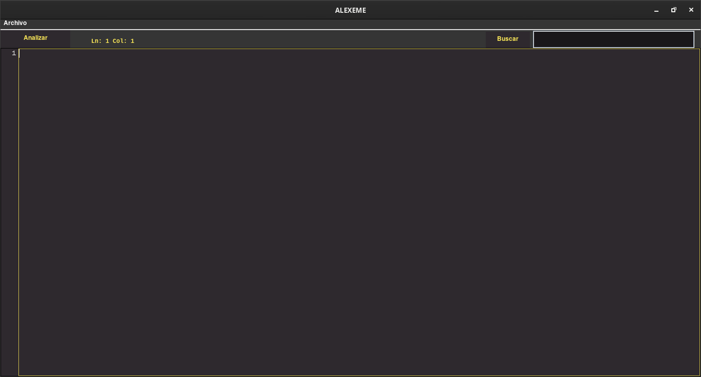

# Manual de Usuario ALEXEME

# Descripción

ALEXEME es un analizador léxico capáz de identificar, hasta el momento, 6 tokens: identificador, número, decimal, punuación, operador, agrupación. 

- Identificador: Son las palabras que cumplen el iniciar con una letra y pueden estar seguidas de muchas letras o muchos dígitos.
- Número: Son palabras que cumplen con tener al menos un dígito o más, y solo puede contener dígitos.
- Decimal: Son palabras que cumplen con tener al menos un dígito o más, seguido de un punto, seguido de uno o más dígitos.
- Puntuación: Ser alguno de los signos de puntuación
- Operador: Ser alguno de los operadores aritméticos
- Agrupacion: Ser alguno de los signos de agrupación

# Uso

## Editor

El editor de texto permite el ingreso de cualquier texto para su análisis. A la izquierda aparece el número de línea, resaltando la línea actual. 

También, en la parte superior del editor aparece la posición actual sobre el *textArea.*

## Buscar

En la parte izquieda de la pantalla aparece un textfiel en donde se pueden poner cadenas que serán buscadas dentro del editor. Para buscar es necesario presionar el botón `Buscar`. Si la cadena es encontrada una o más veces se mostrará en otro editor debajo. 

## Analizar

Para analizar y encontrar los tokens dentro del editor de texto es necesario presionar el botón `Analizar`

### Reporte de errores

Si al momento de analizar existe algún error, debajo se mostrarán los errores con una descripción que será de ayuda para corregirlos. 

### Reporte de tokens

Si no existe ningún error, entonces los se abrirá un diálogo en donde se mostrarán todos los tokens con su lexema y su posición dentro del textArea, también será posible ver los lexemas repetidos con el número de repeticiones y además se podrán ver los movimientos del autómata para cada token.

## Manejo de archivos

### Cargar archivos

Al abrir la pestaña de `Archivo` y luego `Abrir` o presionando `ctrl + o` se abrirá un file chooser que permitirá cargar un archivo de texto dentro del editor. Se cargarán solo archivos de texto.

### Guardar archivos

Al abrir la pestaña de `Archivo` y luego `Guardar` o presionando `ctrl + s` se abrirá un file chooser que permitirá guardar con el texto que está dentro del editor. Se guardará un archivo de texto.

